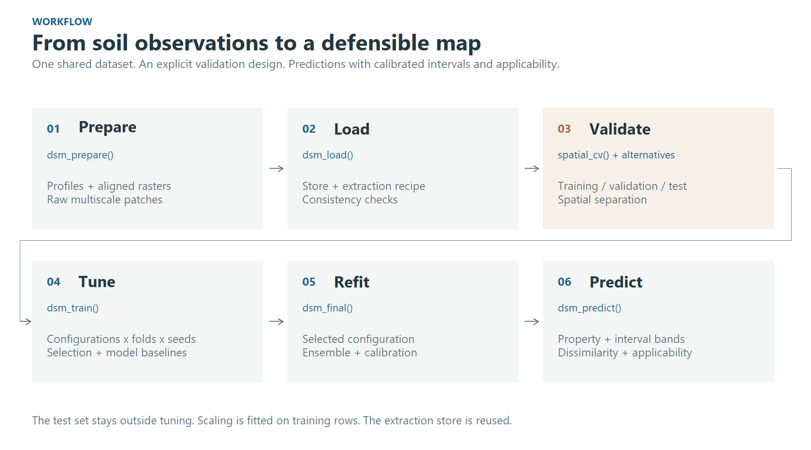
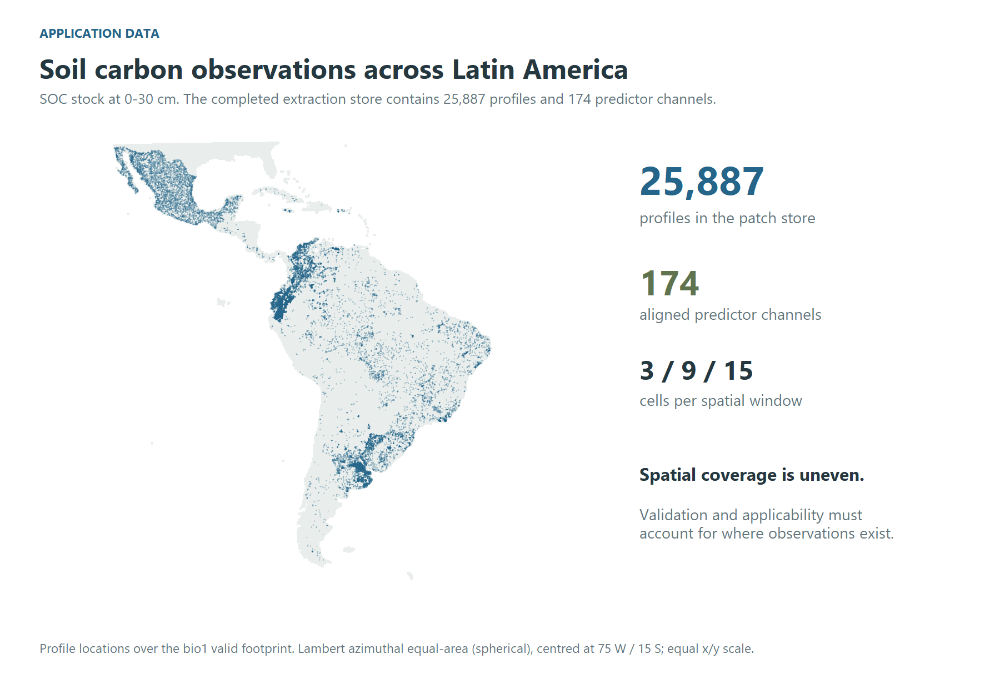
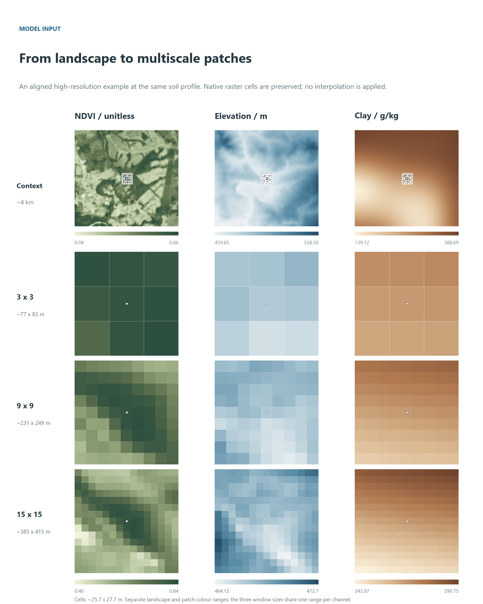
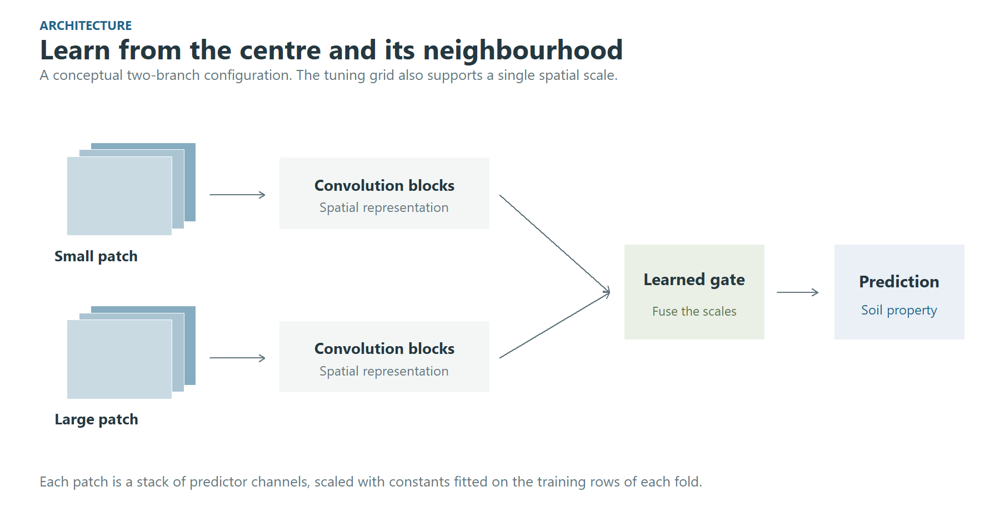
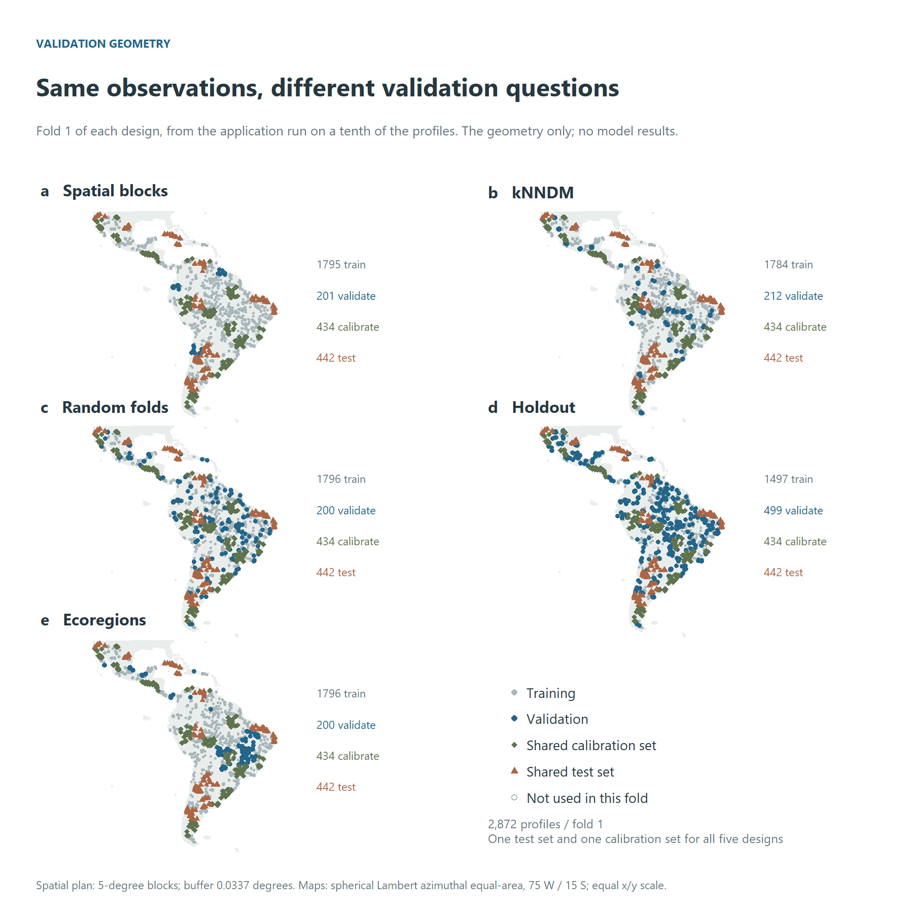
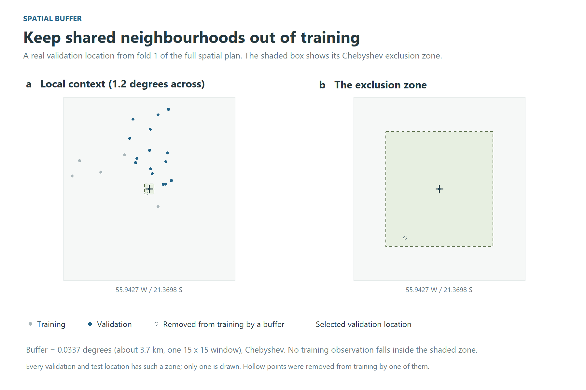
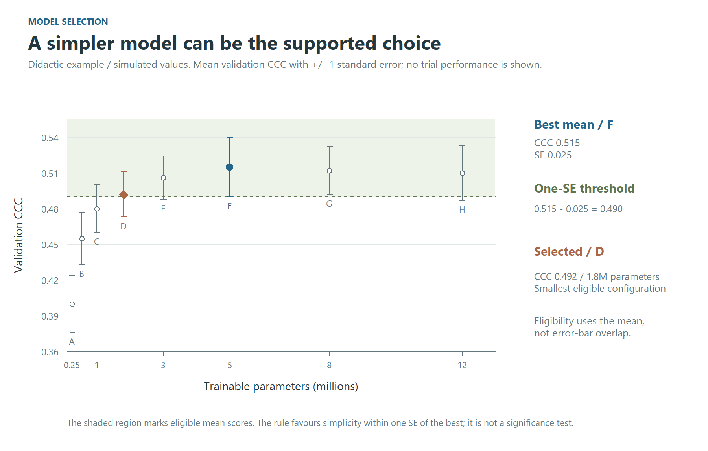

```{r, include = FALSE}
# Nothing here is evaluated when the vignette is built: every step reads data
# the package does not ship, and the tuning step trains for hours. The figures
# are files in figures/, drawn once from real data (see the package's GitHub
# repository, tools/vignette_figures.R).
knitr::opts_chunk$set(eval = FALSE, collapse = TRUE, comment = "#>")
```

```{r, include = FALSE, eval = TRUE}
# The application's figures are drawn from its run (tools/vignette_results.R)
# and committed with its numbers; until then a note stands in for each, so
# the vignette builds without them.
result_figure <- function(file, figure) {
  if (file.exists(file)) return(knitr::include_graphics(file))
  knitr::asis_output(paste0("*", figure, " is drawn from the application run once it completes.*\n"))
}
```

<div class="soilcnn-kicker">SOILCNN / DIGITAL SOIL MAPPING</div>

soilcnn maps a soil property from point observations and a stack of aligned
rasters. A point-based model reads the covariates under each point. The
convolutional network here reads the *neighbourhood* around it, at one or two
window sizes, and everything around the network is there to keep the result
honest:

- spatial folds with a buffer;
- a frozen test set;
- a noise floor measured from the seeds;
- conformal intervals calibrated on held-out residuals;
- the area where the map may be believed.

This vignette walks the whole chain, from preparation to interpretation.
The numbered sections explain the reusable workflow; headings marked
**Application example** show how it is used for SOC stocks in Latin America
and the Caribbean. Results marked DRAFT remain provisional.

```{r, eval = TRUE, echo = FALSE, out.width = "100%", fig.cap = "Figure 1. The workflow keeps data preparation, validation, tuning and final prediction explicit."}

```

The figures come from a real application: soil organic carbon stocks at
0-30 cm over Latin America and the Caribbean, from about 26,000 profiles and
174 predictors at a nominal 250 m resolution. The completed extraction store
contains 25,887 profiles. The geographic raster grid has latitude-dependent
ground dimensions.

```{r, eval = TRUE, echo = FALSE, out.width = "100%", fig.cap = "Figure 2. The full application dataset: profile locations and the predictor footprint. Uneven coverage motivates spatial validation and applicability diagnostics. The map uses a spherical Lambert azimuthal equal-area projection centred at 75 W / 15 S, with equal horizontal and vertical scales."}

```

```{r}
library(soilcnn)
```

## 1. Points and rasters become a patch store

`dsm_prepare()` reads the points and every raster in a folder, runs the
quality control, classifies the predictors, and cuts a patch around each point
at every window you ask for. It writes all of that as a *store*, together with
a recipe (the target transform, the QC rules, the predictor types), so later
steps need only the store.

```{r}
store <- dsm_prepare(
  points     = "profiles.gpkg",        # an sf object, a data frame, or a file sf reads
  target     = "soc_stock",
  raster_dir = "predictors/",          # aligned single-band rasters, one per predictor
  windows    = c(3, 9, 15),            # in pixels: 0.75, 2.25 and 3.75 km at 250 m
  out_dir    = "outputs",
  transform  = "log1p",                # the space the network trains in
  target_min = 0
)
```

`windows` is required. A window's ground extent is its width times the
resolution, so no default would be right at every resolution.

The network reads a stack of predictor channels around each profile. The
illustration below uses separate high-resolution rasters at one of the
application's profiles, in south-eastern Brazil: NDVI, elevation and clay,
aligned on a
0.00025-degree grid (approximately 25.7 m east-west by 27.7 m north-south
at this latitude). These inputs illustrate the patch concept; they were not
used to train the 250 m application described above.

The top row shows approximately 4 km of landscape with nested window outlines.
Below it, the 3 x 3, 9 x 9 and 15 x 15 windows are enlarged to the same display
size. Their ground footprints are approximately 77 x 83 m, 231 x 249 m and
385 x 415 m, respectively. Landscape panels and local patches have separate
colour ranges, shown by their own bars, to reveal variation at both extents.
The three window sizes share one range within each channel.

Fine grid spacing does not imply equally fine original information in every
predictor. The clay source is SoilGrids 2.0, whose source predictions are at
250 m; alignment on the 28 m grid does not add independent fine-scale soil
information. Clay is in g/kg, as documented by
[ISRIC](https://docs.isric.org/globaldata/soilgrids/SoilGrids_faqs_01.html).
Elevation is in metres
([EDTM version 1.1](https://doi.org/10.5281/zenodo.7676373)). NDVI is
dimensionless.

```{r, eval = TRUE, echo = FALSE, out.width = "100%", fig.cap = "Figure 3. Landscape context and native-cell windows from the high-resolution example. The marker identifies the central cell. Bars show source raster values. This illustration is separate from the 250 m trial."}

```

A two-branch configuration learns a representation at each scale and combines
them through a learned gate. This diagram shows the concept; the tuning grid
also includes single-scale models and alternative fusion strategies.

```{r, eval = TRUE, echo = FALSE, out.width = "100%", fig.cap = "Figure 4. Conceptual multiscale architecture. Predictor scaling is fitted on the training rows of each fold."}

```

## 2. Load

```{r}
data <- dsm_load(store)
```

`dsm_load()` opens the store and reads its own tables. It refuses a store whose
recipe does not fit together. It also refuses one whose manifest says the
extraction did not finish.

## 3. Decide who trains and who scores

This is the most consequential line of the chain.

```{r}
cv <- spatial_cv(k = 5, block_size = "auto", buffer = "auto", test_frac = 0.15,
                 calibration_frac = 0.15)
```

"auto" means *measured*:

- the block size comes from how these points are spread;
- the buffer is the largest window times the resolution. That is the exact
  distance at which two patches stop sharing a pixel.

`calibration_frac` sets aside a second held-out set, carved like the test set
in whole blocks and behind the same buffer: no fold trains or validates on it,
and the final model only predicts it. Its residuals calibrate the split
conformal intervals of Section 7. Leave it at 0, the default, and the
intervals are calibrated on the folds alone.

The other designs are one line each, and everything downstream is unchanged:

```{r}
random_cv(k = 10)                         # ignores geography, on purpose
holdout_cv(validation_frac = 0.2)         # a single split
region_cv(group = data$points$biome)      # leave one region out
knndm_cv(k = 5, predpoints = prediction_sample(terra::rast("predictors/elev.tif")))
```

`knndm_cv()` shapes the folds so that the distance from a validation point to
its nearest training point is distributed like the distance from a map pixel to
its nearest training point. It needs a sample of where the map will be drawn,
and it needs the CAST and sf packages.

The five panels below show the plans of a test run on 267 profiles (1% of
the application), with one test set shared by all five designs. Each panel is
fold 1: training, validation, test, and the profiles that fold leaves out.
They illustrate how the designs split the data, not how the models perform.
The spatial blocks here are 0.1 degree; the full run uses 1-degree blocks.

```{r, eval = TRUE, echo = FALSE, out.width = "100%", fig.cap = "Figure 5. Validation geometry: fold 1 of each design, with one test set for all five. Hollow points are not used in this fold. All panels use the same equal-area projection and extent."}

```

Random folds do not enforce geographic separation, so nearby observations can
appear in training and validation. Spatial blocks and region-based plans
introduce geographic separation; kNNDM targets the nearest-neighbour distance
distribution faced during prediction. Each design asks a different validation
question. Their relative scores must be measured in a completed experiment.

The exclusion buffer is easier to see locally. The next illustration uses
fold 1 of the full spatial plan, whose buffer is 0.0337 degrees (about
3.7 km, the width of a 15 x 15 window) in the Chebyshev metric. The shaded
square protects one validation location; every validation and test location
has one.

```{r, eval = TRUE, echo = FALSE, out.width = "100%", fig.cap = "Figure 6. The buffer in the full spatial plan. Grey training points stay outside the shaded exclusion zone; hollow points were removed from training by a buffer."}

```

A plan is worth looking at before a night is spent on it:

```{r}
plan <- resolve_resampling(cv, data)
print(plan)
```

## 4. Tune

```{r}
fit <- dsm_train(
  data,
  model       = "cnn",
  resampling  = plan,
  tune_length = 30,      # a budget, as in caret, not a lattice
  n_seeds     = 3,       # what turns "A beat B" into a claim with an error bar
  output_dir  = "outputs/tuning"
)

fit$by_config                                   # mean and sd, one row per config
print_noise_floor(seed_noise_floor(fit$comparison))
print_one_se(one_se(fit$by_config))             # the simplest config within one SE
```

The grid is drawn over the windows the store holds: every window alone, and
every pair. The batch sizes are ones the smallest fold can fill. The predictions
are scored in native units through the inverse of the store's own transform.

### Tutorial example: choosing a supported level of complexity

The best validation mean is not necessarily the selected model. For CCC,
`one_se()` subtracts the best configuration's standard error from its mean,
then selects the configuration with the fewest parameters among those whose
mean reaches that threshold. Error-bar overlap does not determine eligibility,
and the rule is not a test of statistical equivalence.

```{r, eval = TRUE, echo = FALSE, out.width = "100%", fig.cap = "Figure 7. A didactic, simulated example of the one-standard-error rule. F has the highest mean; D is the smallest configuration above the 0.490 threshold. Bars show plus/minus one SE. These values are not results of the SOC application."}

```

The simulated values illustrate how to read the selection. For a completed
run, use `fit$by_config` for the actual means, standard errors and parameter
counts; the frozen test set stays outside this decision.

### Application example: model selection

In the application, the spatial design's thirty configurations fall as in
Figure 8. The best mean, [DRAFT: config and CCC], is not the choice: its
standard error puts the threshold at [DRAFT: value], and [DRAFT: n]
configurations reach it. The rule takes the smallest of them, [DRAFT: config,
windows and parameters], [DRAFT: k] times fewer parameters than the best for a
CCC [DRAFT: difference] lower. The seed noise floor is [DRAFT: value];
interpret it as training variability, separately from the uncertainty of
the paired difference between configurations.

```{r, eval = TRUE, echo = FALSE, out.width = "100%", fig.cap = "Figure 8. The configurations the spatial design tried in the application, with the one-SE threshold and the configuration it selects. [DRAFT: drawn from the smoke run, layout only]"}
result_figure("figures/trial_selection.png", "Figure 8")
```

## 5. The baselines that give the number a scale

Train them under the same plan, so the comparison is between models and not
between experiments:

```{r}
rf_context <- dsm_train(data, model = "rf", resampling = plan,
                        features = c("centre", "window_mean"), tune_length = 4,
                        output_dir = "outputs/tuning")
rf_point   <- dsm_train(data, model = "rf", resampling = plan,
                        features = "centre", tune_length = 4, output_dir = "outputs/tuning")
```

Compare the CNN with `rf_context` to assess whether learning spatial
arrangement adds predictive skill beyond neighbourhood summaries. A small
gap does not establish how the convolution works: it indicates that an
additional gain has not been demonstrated under this design. Evaluate the
paired difference on the same profiles, with uncertainty estimated by whole
spatial blocks. Variation between seeds provides a separate check on training
stability; it is not the uncertainty of that paired difference.

The same plan runs any of caret's ~230 methods:

```{r}
caret_available("^xgb")
register_model(caret_spec("xgbTree"))
xgb <- dsm_train(data, model = "xgbTree", resampling = plan, tune_length = 4,
                 output_dir = "outputs/tuning")
```

## 6. The test set, once

The test set is carved out when the plan is made, and nothing scores it while
a configuration is being chosen. Record the choice first, then score the test
set:

```{r}
freeze_selection(fit$run_dir, config_id = one_se(fit$by_config)$config_id[1])
score_test_grid(fit$run_dir, data, device = setup_torch_device())
```

`score_test_grid()` refuses to run before `freeze_selection()`, and it prints
both timestamps.

### Application example: validation designs on one test set

The five designs of the application, each carried to its final model, meet on
one test set (Figure 9). The profiles come in clusters, so the interval of a
difference in error is drawn from whole blocks (`block_bootstrap()`), not
from profiles one by one. Every design's model errs by [DRAFT: range] t/ha
on the same profiles; against the spatial design the differences are
[DRAFT: range] t/ha, and [DRAFT: which] intervals exclude zero. What the
designs differ in more is what they promised: the cross-validated CCC of the
random folds was [DRAFT: value] against [DRAFT: value] on the test set, while
the spatial blocks' [DRAFT: value] held ([DRAFT: value]). A design is judged
by how close its estimate comes to the test, not by how good the estimate
looks.

```{r, eval = TRUE, echo = FALSE, out.width = "100%", fig.cap = "Figure 9. Each design's final model on the same test profiles, and its mean absolute error against the spatial design's with a 95% interval from whole 100 km blocks. [DRAFT: drawn from the smoke run, layout only]"}
result_figure("figures/trial_designs.png", "Figure 9")
```

## 7. Refit the chosen configuration

```{r}
final <- dsm_final(fit, seeds = 10)
```

`dsm_final()` refits the configuration the tuning run selects under ten seeds,
side by side. It writes `final_report.md`, which declares every hyperparameter
of the chosen network and whether the search chose it.

It also calibrates the conformal intervals, three ways, and checks each on the
test set:

- `cv`: on the tuning run's cross-validated residuals. It costs nothing and
  promises nothing, since the configuration was chosen on those folds.
- `split`: split conformal, on the calibration set. Coverage is at least the
  level asked for, for points exchangeable with that set (Lei et al. 2018).
- `cv_plus`: CV+, with each fold's own model at the new point (Barber et al.
  2021). Coverage is at least `1 - 2 alpha - sqrt(2/n)`, and close to the
  level in practice. It costs one more pass of the network per fold model.

Each method is computed at a constant width and at one that grows with the
predicted level and the dissimilarity index. The quantile can also weigh every
block alike instead of every point (Dunn et al. 2023): a dense survey then
stops setting the width for everyone. Clustered profiles, and a configuration
chosen on the folds, bend all three guarantees. So the test set is the judge,
reading coverage overall, by block, inside and outside the area of
applicability, and by level:

```{r}
final$per_config[[1]]$intervals$summary
```

### Application example: coverage and interval width

In the application, the five designs' final models were checked on the same
test profiles (Figure 10). [DRAFT: which calibration came closest to 90%, by
design]. The split intervals, calibrated on points no model trained on,
covered [DRAFT: range]; the cross-validated ones [DRAFT: range], and CV+
[DRAFT: range]. The width that follows the level and the dissimilarity index
cost [DRAFT: how much] against the constant one, and held its coverage in
the [DRAFT: lowest and highest] fifths of the predicted stock. Outside the
area of applicability the coverage fell to [DRAFT: value]: there no
calibration speaks for the pixel.

```{r, eval = TRUE, echo = FALSE, out.width = "100%", fig.cap = "Figure 10. The 90% intervals of the five designs on the same test profiles: coverage against the nominal 90% level, and the mean width, for each calibration at a constant width and at one that follows the level and the DI. [DRAFT: drawn from the smoke run, layout only]"}
result_figure("figures/trial_intervals.png", "Figure 10")
```

## 8. The map

```{r}
map <- dsm_predict(final, data, extent = c(-56, -50.5, -15, -13.8),
                   intervals = c("cv", "split"))
map
```

The map is one VRT per band:

- the ensemble median, mean, sd, mad, min and max over the seeds;
- the smeared mean;
- the 90% conformal intervals, one pair of bands per calibration and width,
  e.g. `pi90_split_level_di_lower`;
- the dissimilarity index and the area of applicability.

`intervals = "cv_plus"` adds the CV+ bands. Every fold model then predicts
every pixel, so the map costs several times more network time.

`bands.csv`, beside the bands, says what each one is.

Before it maps, `dsm_predict()` runs a *probe*. It predicts the profiles' own
pixels through the whole chain and compares them with the final model's stored
predictions, so a wrong band order or a wrong scaling stops the run in seconds
instead of producing a plausible map. Drop `extent` for the whole grid. The run
resumes where it stopped, and it refuses to continue if anything that changes
the numbers has changed.

### Where the map may be believed

A map has a value at every pixel, including pixels whose predictor combination
the model never met, and nothing in the raster tells them apart. The
cross-validated error does not describe those pixels. The `di_*` and `aoa_*`
bands (Meyer & Pebesma, 2021) say where it does, and they belong beside the
map, not in a footnote.


### Application example: reading the final maps together

Interpret the predicted stock together with the width of its calibrated
90% interval and its area of applicability. A wide interval indicates less
precise predictions; a pixel outside the AOA has predictor conditions beyond
the applicability criterion derived from validation. The two diagnostics
describe different aspects of reliability.

```{r, eval = TRUE, echo = FALSE, out.width = "100%", fig.cap = "Figure 11. The application's map: the ensemble median, the width of the 90% conformal interval, and the area of applicability. Continuous colour scales use the 2nd and 98th percentiles, clipping values outside those limits for display. [DRAFT: drawn from the smoke run, layout only]"}
result_figure("figures/trial_maps.png", "Figure 11")
```

The median ranges over [DRAFT: range] t/ha, with the highest stocks in
[DRAFT: regions] and the lowest in [DRAFT: regions]. The interval is widest
where the stock is high and where the dissimilarity index is high, as the
scaled calibration intends: [DRAFT: width range] t/ha. [DRAFT: share]% of the
area lies inside the AOA; the pixels outside are [DRAFT: where -- e.g. the
landscapes with few profiles], and there the interval's coverage is not known,
however narrow it is drawn. On the test profiles the 90% interval covered
[DRAFT: value]%.

## 9. What the model learned

```{r}
themes <- read.csv2("importance_themes.csv")[, c("channel", "variable")]
perm <- dsm_importance(final, data, groups = themes)
shap <- dsm_importance(final, data, shap_importance(), groups = themes)
compare_importance(permutation = perm, shap = shap)
plot(shap)
```

`dsm_importance()` takes the method as an argument, as `dsm_train()` takes the
validation design:

- `permutation_importance()`: how much the model relies on a variable; with
  `within =`, what the variable adds beyond the place;
- `context_importance()`: how far from the point, and through which window,
  the network reads;
- `shap_importance()`: how each variable pushes each prediction, up or down;
  with `at =` points of the map, its maps (`importance_map()`);
- `sage_importance()`: how much of the skill each theme carries, a signal two
  themes share split between them;
- `refit_importance()`: whether a variable is needed at all, the seeds trained
  again without it;
- `ale_effect()`: how the prediction changes along each variable's range.

With many correlated predictors, themes are the unit to read: a table of
yours (`channel`, `variable`) groups the channels, and the channels of one
categorical always move together. `rows = "folds"` scores the tuning run's
fold models instead of the final seeds, which is how two validation designs
are compared on what their models learned.

Every model must first give back, point by point, the predictions its run
wrote, and a refit must first train a seed again and get them back. An
importance measured on another model would look just as plausible.

### Application example: importance by theme

```{r, eval = TRUE, echo = FALSE, out.width = "100%", fig.cap = "Figure 12. What the application's model learned, by theme: the drop in CCC when a theme is permuted and its mean absolute SHAP value in separate panels with their original units, and signed SHAP maps on one shared scale for the leading themes. [DRAFT: drawn from the smoke run, layout only]"}
result_figure("figures/trial_importance.png", "Figure 12")
```

The two methods answer different questions, and the application shows it.
SHAP, which splits each prediction among the themes, ranks them almost the
same way under every validation design (Spearman 0.92 to 0.98 between the
designs' rankings [DRAFT: smoke numbers]): the ranking of themes is stable
across these designs. Similar rankings alone do not establish that the models
learned the same spatial relationships. Permutation, which scores what the skill loses when a theme is
broken, agrees less (0.50 to 0.91 [DRAFT: smoke numbers]), most of all
between the holdout and region designs: where correlated themes can stand in
for one another, the drop from breaking one depends on what the model leaned
on, and that is the part a design changes. Climate, vegetation productivity,
the spectral bands and soil properties lead under both [DRAFT: smoke ranking];
relief follows; the categorical maps of land-use change and FAO soil classes
show no detectable contribution in these provisional model-specific
diagnostics. That does not establish that those themes are uninformative in
other models, regions or samples. Read each ranking as a description of the
fitted model, and agreement between designs as evidence of ranking stability
under the validation choices examined.

## About the illustrations

Profile locations come from the full SOC 0-30 cm application at 250 m. The
input-patch illustration uses separate high-resolution raster crops at one of
its profiles. The continental validation panels come from the plans of a
test run on 1% of the profiles; the local buffer detail comes from the full
spatial plan. The model-selection plot of Figure 7 uses simulated values.
Figures 8 to 12 come from the application run on a tenth of the profiles, in
whole blocks stratified by region: its selection, its five designs on one test
set, its intervals, its maps and its importances. The scripts that draw the figures
are in the package's
[GitHub repository](https://github.com/moquedace/soilcnn), under `tools/`;
they read data and fold plans, and fit no model.
